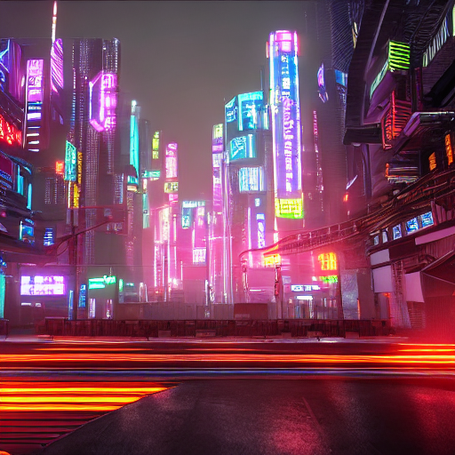

# 🎨 AI 文生图工具（Text-to-Image Generator）

这是一个基于 [Stable Diffusion](https://huggingface.co/CompVis/stable-diffusion-v1-4) 的 AI 文生图小工具。  
输入一句文字（Prompt），即可在 Google Colab 上免费生成对应的图片。  

## 🚀 使用步骤

1. 打开 [Google Colab Notebook](Copy of ai_text2img_demo.ipynb)  
2. 按顺序运行每个代码块  
3. 修改 `prompt`，生成属于你的 AI 图片

## 📸 示例效果

**输入 Prompt**  
a wooden cabin in snowy mountains during sunrise, photo realistic  
**输出结果**  
  
---
**输入 Prompt**  
a cyberpunk city with neon lights, ultra detailed, cinematic, 4k  
**输出结果**  

## 📂 项目结构
ai-text2img/  
├── ai_text2img_demo.ipynb # Notebook代码  
├── results/ # 示例图片  
│ ├── wooden_cabin.png  
│ └── cyberpunk_city.png  
└── README.md # 项目说明文档

## 🛠️ 技术栈
- Python 3
- Google Colab
- Hugging Face diffusers
- PyTorch

## 📢 未来改进方向
- 增加 SDXL / ControlNet 支持
- 做一个网页前端，输入 prompt 即可生成图片
- 加入中文 prompt 支持

## 👨‍💻 作者
- JackHorzt  
